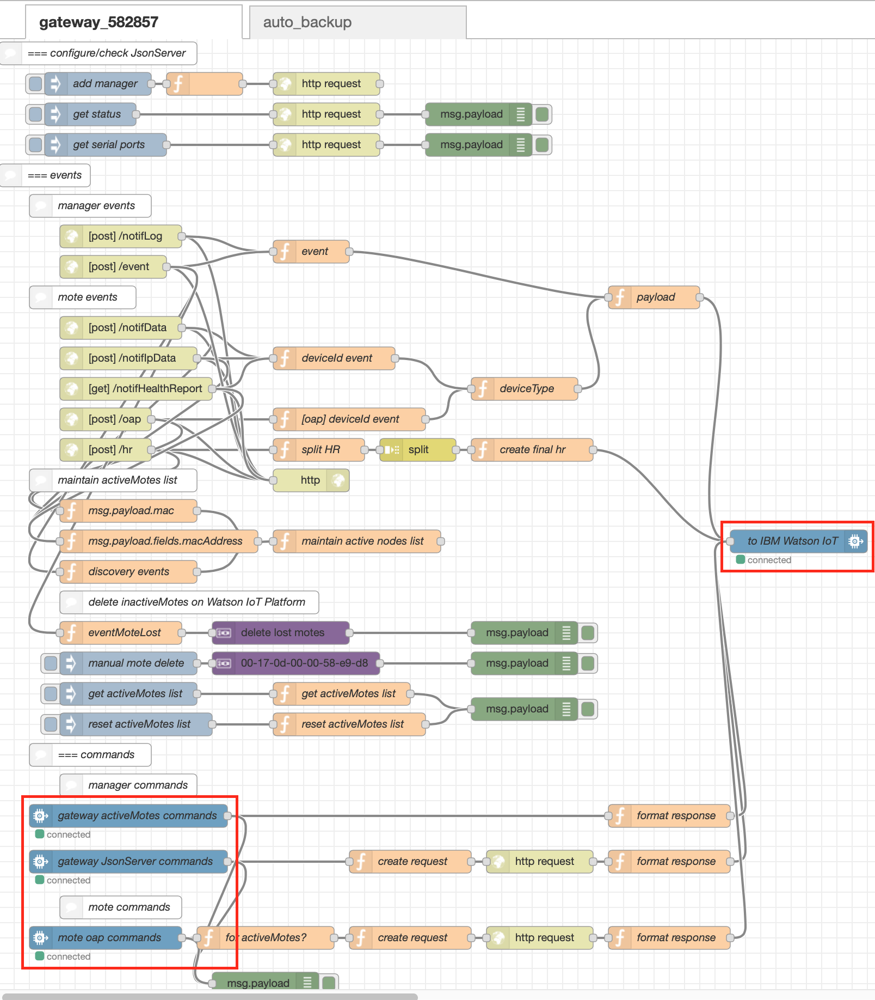
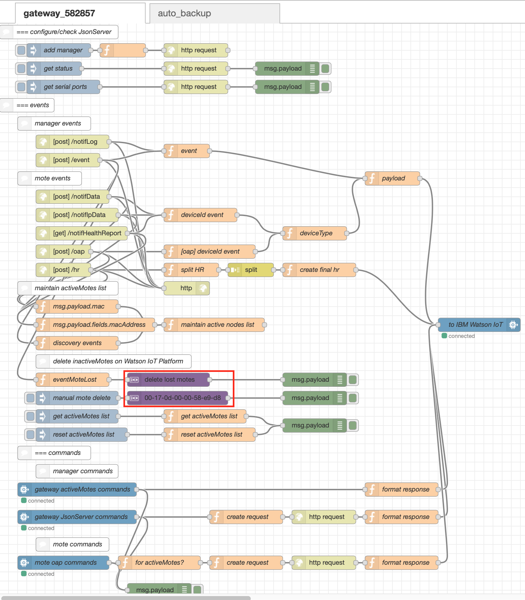
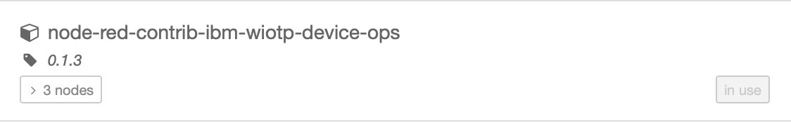
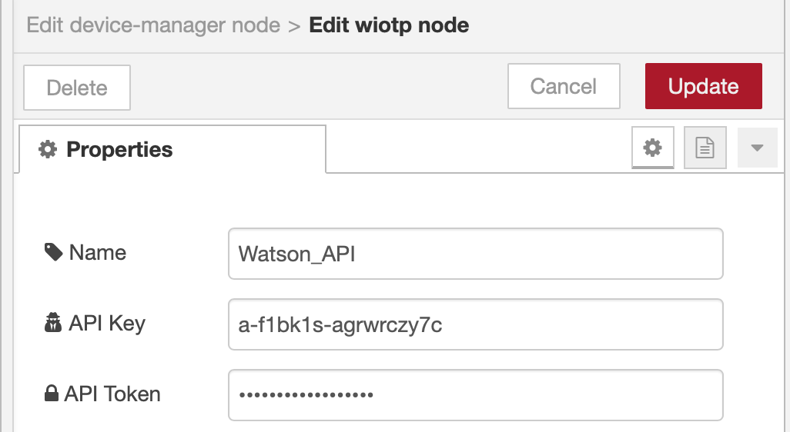
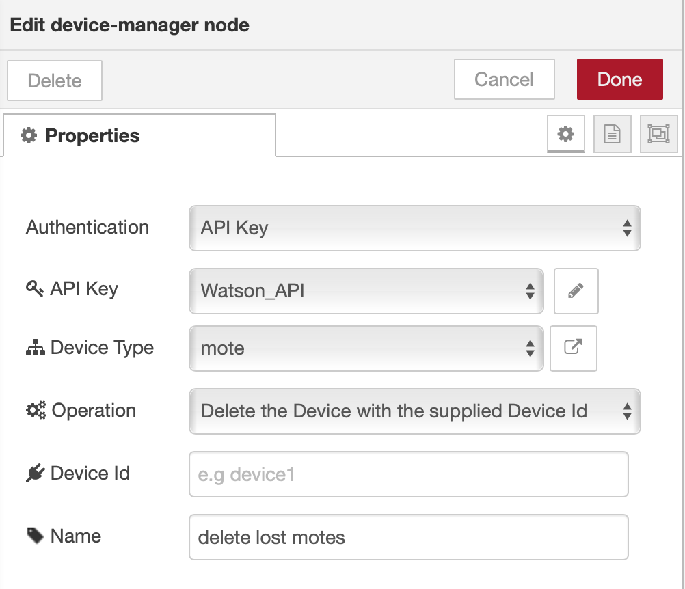

Table of Contents
=================
1. [Introduction](#introduction)
1. [Gateway](#gateway)
    * [Connect to Watson IoT Paltform](#connect-to-watson-iot-platform)
    * [Connect to Device Manager](#connect-to-device-manager)
1. [Auto-backup](#auto-backup)

# Introduction #

This section details the Node-RED flow used for the gateways (managers) in a SmartMesh IP network. The flow can be implemented on the device where the manager is connected to, such as a laptop or a Raspberry Pi.

The flow is created and improved based on the [resources available](https://github.com/twatteyne/smartmesh-bluemix/tree/master/01-gateway). The following documentation provides detailed explanations to the nodes implemented in the flow.

To implement the flows on a Raspberry Pi device, a detailed documentation can be found in the folder [rpi](rpi).

# Gateway #

## Connect to Watson IoT Platform ##

The first configuration required to be done manually in the flow is connecting to the device created on the Watson IoT Platform. The nodes that have to be configured are indicated in the screenshot shown below:



The proper way to configure these nodes are documented in the [basic setup guide](../Basic-Setup-Guide/README.md), under the __Set up Watson IoT Node__ section.

## Connect to Device Manager ##

Another configuration required to be done manually is the device manager nodes that are responsible for deleting the devices on the Watson IoT Platform once they are disconnected from the gateways:



In order to use the nodes, the [corresponding palette](https://flows.nodered.org/node/node-red-contrib-ibm-wiotp-device-ops) has to be installed:



or install with npm:
```
npm install node-red-contrib-ibm-wiotp-device-ops
```
Once the palette is installed, the nodes can be configured.


In the __Authentication__ tab, __API Key__ should be chosen. The API key can be configured in the __API Key__ tab. The API key used here refers to the API key of the Watson IoT Platform, which has been generated (details can be found in the [basic setup guide](../Basic-Setup-Guide/README.md), under the section Generate API Key):



After the information is correctly entered and the Update button is clicked, one of the device types created on the Watson IoT Platform (in this case, 'mote') will be automatically shown in the Device Type tab, and a blank tab would indicate either incorrect API Key information or no device type created on the Watson IoT Platform:



# Auto-backup #

This function is created in the event when the flow is accidentally lost on the hosting device.
