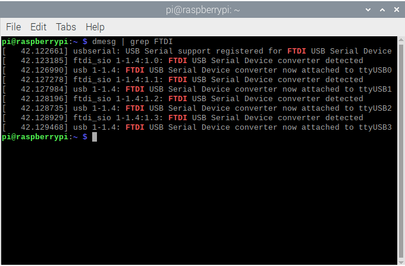
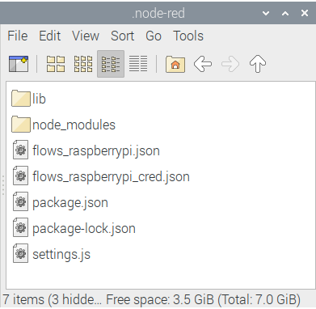
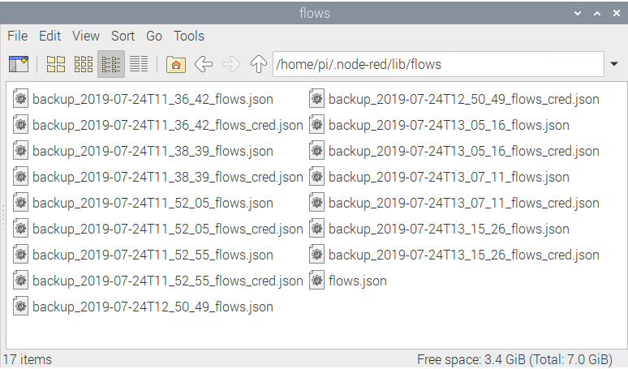
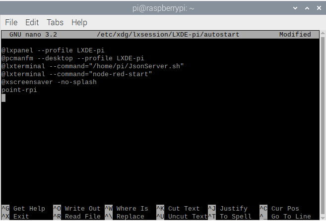

Table of Contents
=================
1. [Raspberry Pi Setup](#raspberry-pi-setup)
    * [Update to Jessie](#update-to-jessie)
    * [Install Node-RED](#install-node-red)
    * [FTDI Driver Configuration](#ftdi-driver-configuration)
    * [Install JsonServer Application](#install-jsonserver-application)
    * [Performance Improvement](#performance-improvement)
1. [Configure Node-RED Flows](#configure-node-red-flows)
    * [Connect to Watson IoT Platform and Device Manager](#connect-to-watson-iot-platform-and-device-manager)
    * [Auto-backup](#auto-backup)
    * [Errors in Nodes](#errors-in-nodes)
1. [Run Services on Boot](#run-services-on-boot)

# Raspberry Pi Setup #

In this project, the Raspberry Pi 2 is used to host the SmartMesh Network manager.

## Update to Jessie ##

In order to install Node-RED properly, the Pi has to be updated from Wheezy to Jessie.

A useful and tested tutorial to do so can be found in this [link](https://www.howtoforge.com/tutorial/how-to-upgrade-debian-wheezy-to-jessie-stable-release/).

## Install Node-RED ##

Once the system is set up, Node-RED can be [installed](https://nodered.org/docs/getting-started/raspberrypi) with the code:

```
bash <(curl -sL https://raw.githubusercontent.com/node-red/raspbian-deb-package/master/resources/update-nodejs-and-nodered)
```

If the Pi fails to install Node.js, it can be manually installed before installing Node-RED, and a useful and tested resource can be found [here](https://learn.adafruit.com/node-embedded-development/installing-node-dot-js).

Minor errors may occur during the installation process. They should be fixed by re-running the installation.

## FTDI Driver Configuration ##

FTDI drivers are included in the OS, and hence no installation in required.

When the manager is connected to the Pi, FTDI should be loaded by the kernel and can be checked with the command:

```
dmesg | grep FTDI
```

A sample of the result can be seen below:



A common serial port used to communicate with the device's API is __/dev/ttyUSB3__, which is the one in this case.

To access the device as an unprivileged user, permissions have to be fixed on both /dev/ttyUSB2 and /dev/ttyUSB3:

```
sudo chmod 666 /dev/ttyUSB[23]
```

A detailed explanation on this can be found in the __[SmartMesh IP Tools Guide](https://www.analog.com/media/en/technical-documentation/user-guides/smartmesh_ip_tools_guide.pdf)__, under the section __3.2.2 Linux FTDI Driver installation__.

## Install JsonServer Application ##

The SmartMeshSDK package can be downloaded from the [link](https://github.com/dustcloud/smartmeshsdk).

Alternatively, download the package with the command:

```
wget -q -O ~/smartmeshsdk-master.zip https://github.com/dustcloud/smartmeshsdk/archive/master.zip
```

Unzip the package with the command:

```
unzip -q ~/smartmeshsdk-master.zip
```

To setup the applications, direct to the SmartMeshSDK folder:

```
cd /home/pi/smartmeshsdk-master
```

Start the setup with the command

```
python setup.py install
```

To run the JsonServer application properly, direct to the application folder:

```
cd /home/pi/smartmeshsdk-master/app/JsonServer
```

Start the application with the command:

```
python JsonServer.py
```

To connect the manager in the application, the following command can be used (where /dev/ttyUSB3 is the API port to communicate with the manager, which can be found in the [FTDI configuration section](#ftdi-driver-configuration)):

```
cm /dev/ttyUSB3
```

Note that a JsonServer.config file will be automatically generated in the folder when the manager is created, which is the reason why the application is run after making the working directory to the applicaiton folder. If the application is run directly with a home directory, the .config file will be generated there.

Although the generated JsonServer.config file is supposed to record the manager information and allow the manager to be automatically connected without any manual input, it failed to do so during this project. A fix to this issue is presented below:

Open the JsonServer.py file and go to the end of the file, where a section as the one shown below can be found:

```
#============================ main ============================================

def main(args):
    jsonServer = JsonServer(**args)

if __name__=="__main__":
    parser = argparse.ArgumentParser()
    parser.add_argument('--tcpport',        default=8080)
    parser.add_argument('--autoaddmgr',     default=True)
    parser.add_argument('--autodeletemgr',  default=True)
    parser.add_argument('--serialport',     default=None)
    parser.add_argument('--configfilename', default='JsonServer.config')
    args = vars(parser.parse_args())
    main(args)
```

It can be seen that the default state of the __--autodeletemgr__ argument is __True__. This can be manually changed to __False__, and the resulting section of the code should look like:

```
#============================ main ============================================

def main(args):
    jsonServer = JsonServer(**args)

if __name__=="__main__":
    parser = argparse.ArgumentParser()
    parser.add_argument('--tcpport',        default=8080)
    parser.add_argument('--autoaddmgr',     default=True)
    parser.add_argument('--autodeletemgr',  default=False)
    parser.add_argument('--serialport',     default=None)
    parser.add_argument('--configfilename', default='JsonServer.config')
    args = vars(parser.parse_args())
    main(args)
```

As such, once the manager /dev/ttyUSB3 is connected to the application, it will remain the manager when the application is re-launched, and its status will be shown as either __connected__ or __disconnected__.

To disconnect the manager in order change to another one, the command can be used:

```
dm /dev/ttyUSB3
```

## Performance Improvement ##

According to Lindsay Bill from the Dust Support, there is a busy wait at line __168__ of __\smartmeshsdk-REL-1.3.0.1\libs\SmartMeshSDK\utils\SerialScanner.py__, which will consume an entire core of the quadcore Raspberry Pi CPU.

Replace the line:

```
pass # wait for listenThread to stop
```

with:

```
time.sleep(0.5) # wait for listenThread to stop
```

This problem is also fixed in the pre-release build 1.3.1.2, which can be accessed [here](https://github.com/dustcloud/smartmeshsdk/releases).

# Configure Node-RED Flows #

The flows used on the Pi are identical to that used on other devices, with some slight modifications in configurations.

The flows can be found in the [flows_raspberrypi.json](flows_raspberrypi.json) file.

## Connect to Watson IoT Platform and Device Manager ##

To connect the flows to the Watson IoT Platform, as well as to configure the Device Manager nodes in the flow, the same procedures introduced in the [Gateway](../README.md) section is used

## Auto-backup ##

The directories under the auto-backup flow should be changed for the Pi to function properly.

Similar to the setup on other devices, the first node should be connected to the default flow loaded by Node-RED, which can be found under the directory:

```
~/.node-red
```



The backup files can be saved to the library folder:

```
~/.node-red/lib/flows
```



## Errors in Nodes ##

Errors and notifications of displayed on the Pi's Node-RED nodes can be ignored and the flows can be deployed, as long as the flows are tested to be running properly on other devices.

# Run Services on Boot #

The Pi can be configured to run both the JsonServer application and the Node-RED flows automatically without any user input after booted up.

There are several approaches to do so, and the one used in the project is to start the services after login and showing them in separate terminal screens.

Firstly, a [JsonServer.sh](JsonServer.sh) bash script is created under the /home/pi/ directory:

```
sudo nano /home/pi/JsonServer.sh
```

Add in the following content:

```
#! /bin/bash

cd /home/pi/smartmeshsdk-master/app/JsonServer
python JsonServer.py
read -p "Press Enter to Exit"
```

Save and exit the file with:

<kbd>Ctrl</kbd> + <kbd>X</kbd> , <kbd>Y</kbd>, <kbd>Enter<kbd>

 It is important to ensure the file is executable, which can be achieved with:

```
sudo chmod 777 /home/pi/JsonServer.sh
```

Next, lxterminal sessions after login can be created.

Navigate and open the LXDE autostart file:

```
sudo nano ~/.config/lxsession/LXDE-pi/autostart
```

If the file does not exist on Raspberry Pi 3, try this command:

```
sudo nano /etc/xdg/lxsession/LXDE-pi/autostart
```

Inside the autostart file, add the following commands before the command __@xscreensaver -no-splash__ (adding commands at the end may result in them not running):

```
@lxterminal --command="/home/pi/JsonServer.sh"
@lxterminal --command="node-red-start"
```

Note that it is not advised to run lxterminal with "sudo" command for the Node-RED flows (@sudo lxterminal --command="node-red-start") since it would cause the Node-RED to load flows from the /root/ directory and the flows under /home/pi/ directory would not be loaded.

The resulting file would look like:



Save and exit the file with:

<kbd>Ctrl</kbd> + <kbd>X</kbd> , <kbd>Y</kbd>, <kbd>Enter<kbd>

Reboot the Pi and the two terminal sessions should be running.
