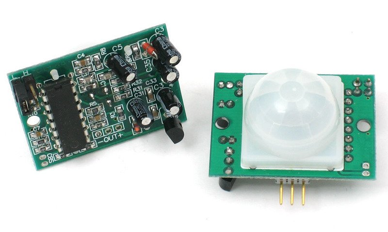
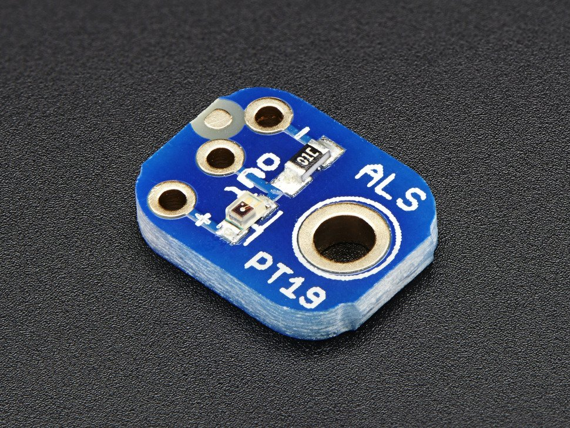
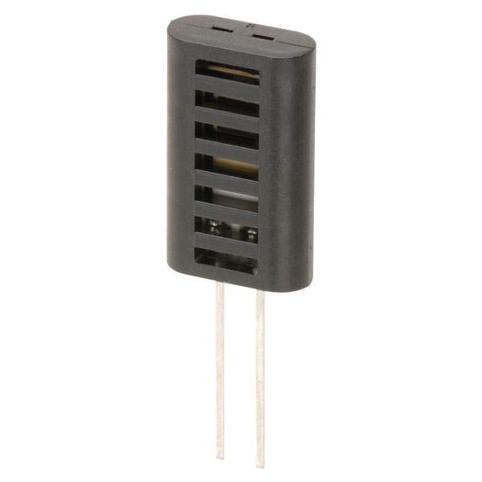
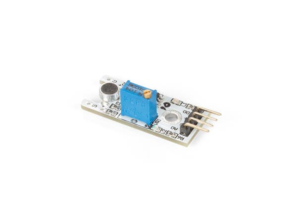
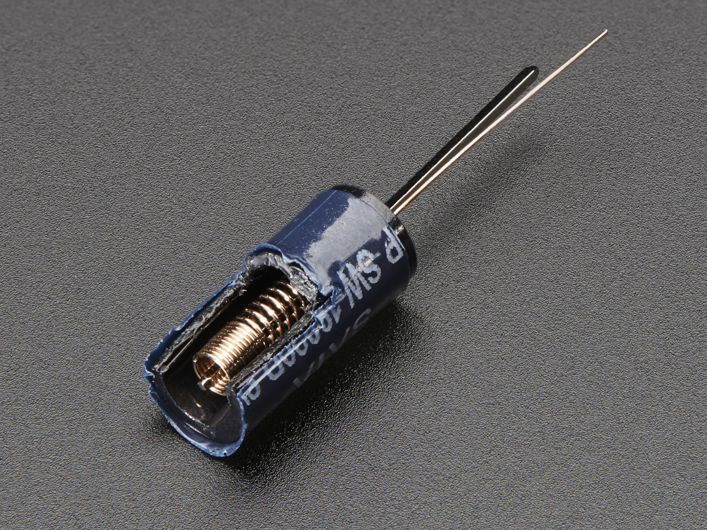

Table of Contents
=================
1. [Introduction](#introduction)
1. [Design Considerations](#design-considerations)
1. [Circuit Design](#circuit-design)
    1. [Sensors](#sensors)
        1. [PIR Motion Sensor](#pir-motion-sensor)
        1. [Light Intensity Sensor](#light-intensity-sensor)
        1. [Humidity Sensor](#humidity-sensor)
        1. [Audio Sensor](#audio-sensor)
    1. [Power Supply](#power-supply)
    1. [Power Consumption](#power-consumption)
    1. [PCB Design](#pcb-design)
1. [3D Printed Enclosure](#3d-printed-enclosure)
1. [Deployment Strategy](#deployment-strategy)
1. [Bill of Materials](#bill-of-materials)

# Introduction #

After the establishment of the working communication system from the mote to the gateway and to the Watson IoT Platform, a testbed was designed to utilise the system and showcase its practical feasibility. The objective of the testbed is to take advantage of the input and output ports on the mote to create an indoor environmental data collection device. A gateway (Raspberry Pi with the manager) and multiple motes would be deployed in a room to dynamically monitor the indoor environment simultaneously. The collected data should be accessible online anytime, anywhere, and could be extracted for data analytic purposes.

The following sections would provide a detailed explanation of the hardware designs, and the materials used for the project could be found in the last section, [**Bill of Materials**](#bill-of-materials).

# Design Considerations #

The first design consideration of the testbed is its portability. In order to retrofit a testbed into an existing room, it should be as non-intrusive as possible. Therefore, the testbed should have a relatively small form factor and would not interfere normal functions of, or activities carried out in the room.

As such, the printed circuit board (PCB) which hosts the sensors and circuits would be stacked on top of the mote using the nylon standoffs. The PCB would also have a smaller footprint than the mote, and therefore not increasing the dimension of the footprint. Moreover, the motes would be powered by individual power supplies and therefore not having cable or extensions to the wall, allowing them to be deployed in the room with maximum flexibility.

The second design consideration is the low requirement and ease on repair and maintenance. To reduce frequency of maintenance, particularly the need of recharging the power supply, the power consumption of the system should be as low as possible. This objective led to choices of sensors with extremely low power consumption, and sometimes with a trade-off of its performance.

The last consideration of the testbed is its robustness in deployment. Since the testbeds would be deployed with little supervision and maintenance, they should not be easily susceptible to malfunction and physical damages. In order to achieve this objective, a more finished and solid PCB with soldered components, compared to the prototype breadboard design would be fabricated, and each individual testbed, including the mote, the PCB and the power supply, would be kept in a 3D printed enclosure to protect it from external factors as much as possible.

# Circuit Design #

## Sensors ##

Since the mote could only support analog and digital inputs, digital and analog sensors would be chosen. The digital sensor output should not exceed the supply voltage of the mote at approximately 2.8 V, and the analog sensor output should not exceed 1.7 V when connected to the mote ananlog input pins.

### PIR Motion Sensor ###

The PIR motion sensor is used to detect motion, usually due to human activities, using infrared.

Multiple PIR sensors were tested, and the **adafruit PIR Motion Sensor** was chosen due to its low power consumption as well as the availability of range and delay time adjustment on the sensor.

The sensor has an input voltage range of 5 V - 12 V and outputs a digital signal of 3.3 V.

When deployed, the sensor should face the direction in which human activities are predicted to happen (the sensor itself has a 120 degree detecting angle), and should not face high intensity infrared sources such as sunlight.

### Light Intensity Sensor ###

The light intensity sensor is used to measure the light condition in the room, in order to measure the amount of daylight in the room throughout the day. It could also be used to detect a sudden increase in surrounding light, indicating light sources being manually switched on. One of the potential applications of this sensor in a more intelligent system would be to automatically switch on/off, and adjust the intensity of lighting in the room based on the natural lighting intensity, thus saving energy consumption in the building.

The **adafruit Light Sensor Breakout** was chosen due to its low power consumption and ability to output a range of analog voltages based on the input light intensity (higher output voltage with increasing input light intensity). The sensor accepts an input voltage range from 2.5 V to 5.5 V. An additional resistor was connected at the output when a 3.3 V input voltage was supplied to ensure that the maximum output voltage was kept under 1.7 V by shining mobile phone flash light directly at the sensor.

When deployed, the sensor should face the direction in which monitored light sources or lighting conditions are located. Possible choices be windows and working locations in the room.

### Humidity Sensor ###

The relative humidity sensor is used to measure the relative humidity of the indoor environment. Relative humidity, together with temperature, are important factors influencing the comfort level experienced by the people in the room. One potential application of this sensor could be to monitor the indoor relative humidity and intelligently adjust the settings of the air conditioner such that a conducive indoor environment is maintained and optimised for working.

The **TruSens Humidity Sensor** was chosen for the application due to its low power consumption. The sensor measures a range of relative humidity from 20% to 90%. The sensor is essentially a variable impedance whose resistance would change according to the temperature and humidity of the environment it is located in.

When deployed, the sensor should be kept away from sources with much lower or higher relative humidity compared to the rest of the room. Possible sources with abnormal relative humidity levels could be air conditioner output, heater/radiator and opened windows.

### Audio Sensor ###

The audio sensor is used to measure the audio level or detect the change in such level in the indoor environment. Audio level could be another metric that indicates the amount of human activities in the room. The audio sensor could be used together with the PIR sensor in order to provide a better data collection of the activities in the room.

The **Velleman Microphone Sound Sensor Module** was chosen for the project due to its dual output options (both digital and analog). The analog option is able to output an analog voltage level based on the sound level detected, and the digital option is able to output a digital voltage signal based on the threshold level set on the sensor through a variable resistor.

When deployed, the sensor should be position to face the direction of potential sound sources. It should not be located close to sources of high level noise, such as the windows and the door.

### Vibration Sensor ###

The vibration sensor is used to detect any vibration or movement created by human activities, such as opening and closing the doors. Its simple working principle, acting as a switch triggered by vibration, has made it ideal for the project as a digital sensor.

The **adafruit Vibration Sensor Switch** was chosen for the project due to its low cost and small form factor. There are three types of sensors available, namely the slow, medium and fast versions. The varying stiffness of the spring within the sensor structure determines how easily the sensor could be triggered, and the fast/medium versions were deemed as suitable for the project as the slow version was too difficult to be activated during experiments.

When deployed, the mote equipped with the vibration sensor would be installed on the door in order to detect people entering or leaving the room. This sensor would provide a more holistic picture of the human activities in the room on top of other sensors, such as potentially recording data with starting and ending time of the activities, hence simplifying data analysis processes.

## Power Supply ##

Since majority of the sensors require a supply voltage larger or equal to 3.3 V, and the analog sensors require a constant voltage supply in order to provide sensible and reliable outputs, 3.3 V was chosen as the main supply voltage for the sensors.

As such, a battery pack consisting of 3 AA batteries at approximately 4.8 V was used as the power supply. The voltage directly supplies the PIR Motion Sensor, and other sensors are supplied via a 3.3 V linear voltage regulator.

## Power Consumption ##

Initially, the UA78M33 linear voltage regulator was used to supply the circuit with a constant 3.3 V voltage. However, it was observed that the working current was close to 3 mA with majority of the current drawn by the regulator. Under such condition, the battery pack with typical AA alkaline batteries (2500 mAh) would last for approximately one month before it runs out.

Therefore, a **Low Quiescent Current LDO Regulator**, with a typical 2.0 uA quiescent current and 250 mA maximum output current, was used to replace the original regulator. This modification significantly improved the power consumption performance of the system and it was estimated to last for over a year without any battery replacement.

The audio sensor was chosen to be implemented at later stage of the project. The sensor draws approximately 2 mA during idling, which consumes a large amount of power compared to the rest of the circuit. However, the sensor was still kept to be part of the design as it could provide extra useful data. To alleviate its undesirable power consumption performance as much as possible, it was designed that the sensor would be switched on periodically at a very low frequency by a transistor using one of the digital output on the mote. For instance, turning it on for 10 s every hour would bring the average current drawn down to 5.6 uA, 10/3600 of the original amount.

## PCB Design ##

The PCB of the circuit was designed with the DipTrace software to facilitate its fabrication at the Roberts Building 6th Floor Teaching Lab.

Iterations of the PCB designs are included in the [Schematics folder](Schematics/README.md). Since a rapid prototype which is easy to fabricate was required, through-hole design was implemented so that the components and pins could be soldered on with ease. Soldered PCBs may be referred to while soldering new boards since the pins were not labelled on the PCB design files.

To connect the PCB pins to the mote's analog pins, terminal blocks were soldered onto mote. The detailed information of the terminal blocks can be found in the [Bill of Materials](#bill-of-materials) section.

# 3D Printed Enclosure #

A prototype 3D printed enclosure for the mote, PCB and the battery pack was designed using the Autodesk Fusion 360 software. The .stl design files were exported and printed at the 6th Floor Teaching Lab. To facilitate printing, the design was separated into three parts consisting of the base and two parts which could be glued together to form the lid.

The 3D design, as well as the .stl files used for printing can be accessed in the [3D-Design](3D-Design/README.md) folder.

# Deployment Strategy #

# Bill of Materials #

| Name of Sensor | Product Number | Price (in GBP) | Supplier with Link | Datasheet |
|:--------------:|:--------------:|:--------------:|:------------------:|:---------:|
|Adafruit PIR Motion Sensor|-|7.58|[Digi-Key UK](https://www.digikey.co.uk/product-detail/en/adafruit-industries-llc/189/1528-1991-ND/6827035?utm_adgroup=&utm_source=google&utm_medium=cpc&utm_campaign=Google%20Shopping_Sensors%2C%20Transducers&utm_term=&productid=6827035&gclid=EAIaIQobChMI1aLBk6755gIVF-DtCh1vDgU4EAQYASABEgKHLvD_BwE)|[Available](https://cdn-learn.adafruit.com/downloads/pdf/pir-passive-infrared-proximity-motion-sensor.pdf?timestamp=1578657735)
| | |9.00|[The Pi Hut](https://thepihut.com/products/adafruit-pir-motion-sensor?variant=27739667793&currency=GBP&gclid=EAIaIQobChMI1aLBk6755gIVF-DtCh1vDgU4EAQYAiABEgKbLvD_BwE)|
|Adafruit Analog Sensor|ALS-PT19|2.52|[Rapid Electronics](https://www.rapidonline.com/Catalogue/Search?Query=als%20pt19)|[Available](https://static.rapidonline.com/pdf/73-5282_v1.pdf)
| | |2.50|[The Pi Hut](https://thepihut.com/products/adafruit-als-pt19-analog-light-sensor-breakout)| |
|TruSens Humidity Sensor|HCZ-J3A|0.856|[Rapid Electronics](https://www.rapidonline.com/trusens-hcz-j3a-humidity-sensor-61-0984)|[Available](https://static.rapidonline.com/pdf/61-0984.pdf)
|Velleman Microphone Sound Sensor Module|VM309|4.32|[CPC](https://cpc.farnell.com/velleman-kit/vma309/sound-sensor-module-for-arduino/dp/SC14406)|[Available](https://www.velleman.eu/downloads/29/vma309_a4v02.pdf)|
| | |4.13|[Velleman](http://www.velleman.co.uk/contents/en-uk/p920_Velleman_Arduino%E2%84%A2_Microphone_Sound_Sensor_Module.html)|
|Adafruit Vibration Sensor Switch|Fast, Medium & Slow|1.00|The Pi Hut ([Fast](https://thepihut.com/products/adafruit-fast-vibration-sensor-switch-easy-to-trigger)/[Medium](https://thepihut.com/products/adafruit-medium-vibration-sensor-switch)/[Slow](https://thepihut.com/products/adafruit-slow-vibration-sensor-switch-hard-to-trigger))|Not Available, but some details available on adafruit webpages ([Fast](https://www.adafruit.com/product/1766), [Medium](https://www.adafruit.com/product/2384) & [Slow](https://www.adafruit.com/product/1767))
| | | | | |
|**Name of Component (Not Available at the Lab)**|**Product Number**|**Price (in GBP)**|**Supplier with Link**|**Datasheet**|
|Wire-to-Board Terminal Block, 3.5 mm, 2 Ways, 24 AWG, 18 AWG, Screw|CTBP3051/2|0.295|[Farnell](https://uk.farnell.com/camdenboss/ctbp3051-2/tb-wire-to-board-2pos-24-18awg/dp/2527545)|[Available](http://www.farnell.com/datasheets/2866690.pdf?_ga=2.252054154.2068100190.1578778119-1887109346.1578778119)|
|3.3 V Fixed LDO Voltage Regulator|MCP1702-3302E/TO|0.408|[Farnell](https://uk.farnell.com/microchip/mcp1702-3302e-to/ic-v-reg-ldo-250ma-to-92-3/dp/1331485?scope=partnumberlookahead&ost=MCP1702-3302E%2FTO&searchref=searchlookahead&exaMfpn=true&ddkey=https%3Aen-GB%2FElement14_United_Kingdom%2Fw%2Fsearch)|[Available](https://4donline.ihs.com/images/VipMasterIC/IC/MCHP/MCHPS03366/MCHPS03366-1.pdf?hkey=52A5661711E402568146F3353EA87419)

*Prices were quoted at the time of the documentation for reference purposes only
