Table of Contents
=================
1. [Introduction](#introduction)
1. [Watson IoT Platform](#watson-iot-platform)
    * [Prerequisite](#prerequisite)
    * [Create Device Types](#create-device-types)
    * [Create a Manager Device](#create-a-manager-device)
    * [Create a Mote Device](#create-a-mote-device)
    * [Generate API Key](#generate-api-key)
1. [Node-Red on Local Devices](#node-red-on-local-devices)
    * [Palette Required](#palette-required)
    * [Set up Watson IoT Node](#set-up-watson-iot-node)
1. [Node-Red on Watson IoT Platform](#node-red-on-watson-iot-platform)

# Introduction #

This setup guide aims to provide a comprehensive guidance to connecting the SmartMesh IP devices (both the managers and the motes) to the IBM Watson IoT Platform.

The setup is part of the progress made during the summer project from Jun to Aug 2019 under the supervision of Dr. Ryan Grammenos at UCL. Due to the rapid upgrading and modificaitons done on the IBM services, this guide may become obsolete.

It shall also be noted that the guide assumes basic knowledge with both the Node-RED and the IBM cloud services, and the focus of the guide is to enhance the convenience and ease while setting up the devices.

# Watson IoT Platform #

## Prerequisite ##
Firstly, the following apps and services are required to be set up:

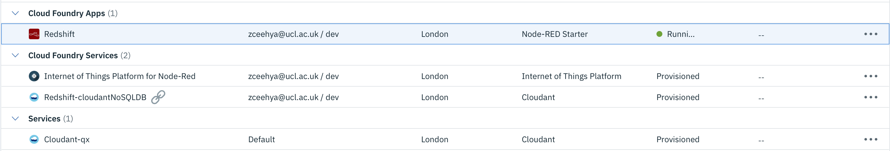

Secondly, a connection has to be established between the __*Internet of Things Platform*__ service and the __*Node-RED Starter*__ app as shown below. This can be done in the __*Internet of Things Platform*__ service:

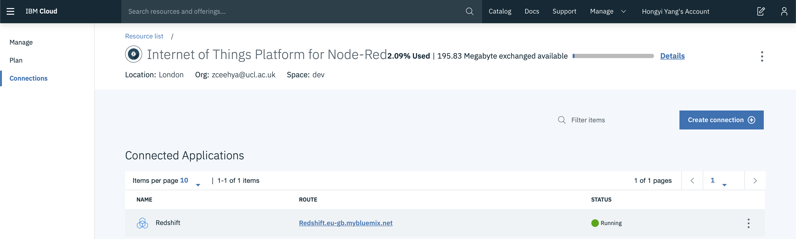

Note that connecting to the app would involve restaging it. However, it has been noticed that further connections established between other services and the __*Node-RED Starter*__ app would result in the mulfunctioning of the Node-RED flows.

## Create Device Types ##
It is essential that this step is done before proceeding to setting up the managers and motes on the Watson IoT Platform.

After launching the __*Internet of Things Platform*__, device types can be created under the __*Device Types*__ tab:

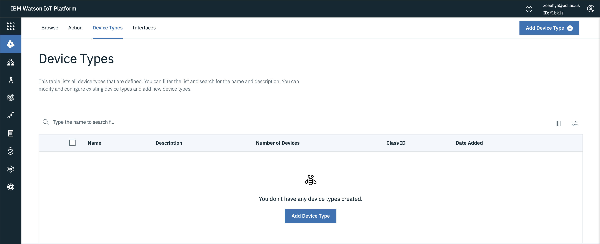

By clicking on the __*Add Device Type*__ button, devices can be added.

A manager type can be created by selecting the device __Type__ as __Gateway__:

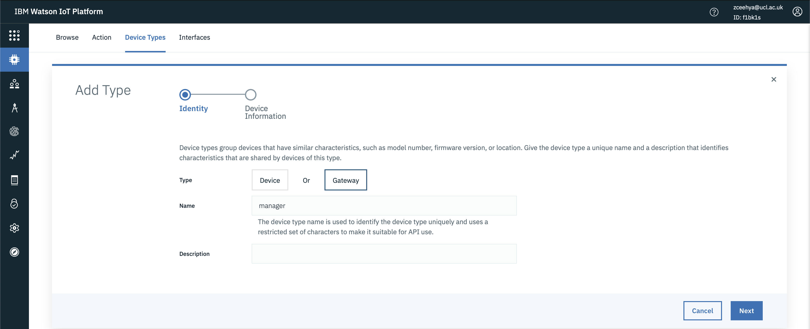

A mote type can be created by selecting the device __Type__ as __Device__:

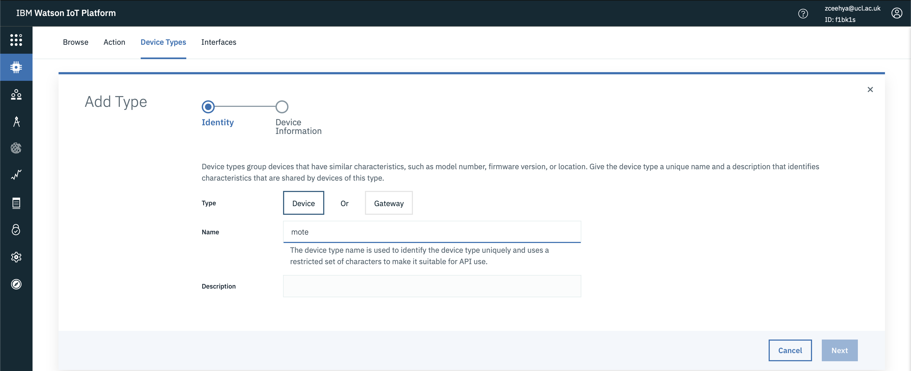

After the device types have been created, individual devices can then be created:

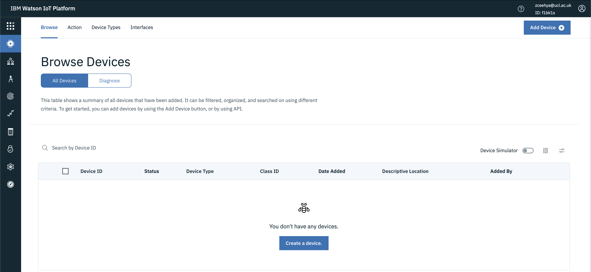

## Create a Manager Device ##

A manager can be created by clicking on the __Create a device__ (will not show up once the first device is created) or the __Add Device__ button, bringing up the page:

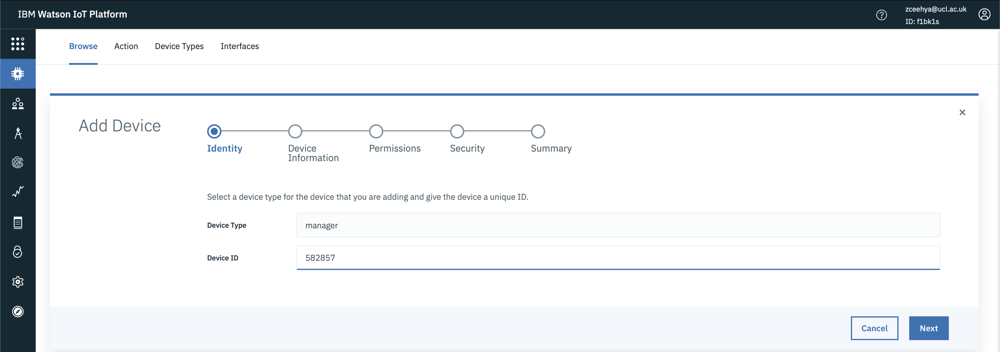

The __Device Type__ is selected as __manager___, which has been created as a gateway device type.

There is no fixed format for __Device ID__.

Once reaching the __Security__ step, an __Authentication Token__ is required. This can be left blank for it to be generated automatically:

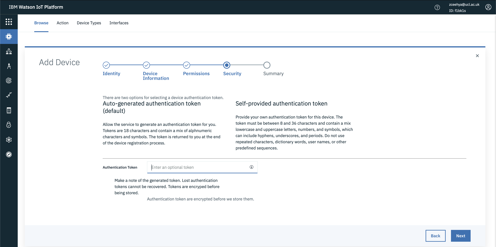

After finishing all the steps, a new page of the device credentials would be brought up:

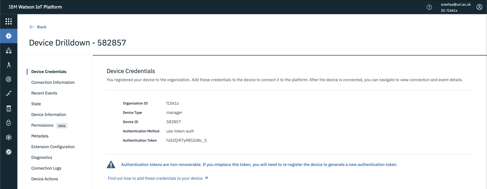

It is __important__ that this page (or the credentials on the page) is saved to be referred to later on since the credentials will not be accessible once leaving this page.

## Create a Mote Device ##

Motes will be automatically created by the manager gateways once the managers establish connections with them. Therefore, a mote device does not have to be created manually here.

## Generate API Key ##

The API key used to access the Watson IoT Platform can be generated under the __App__ tab:

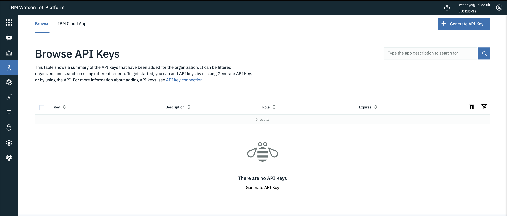

API can be generated by clicking on the __Generate API Key__ button:

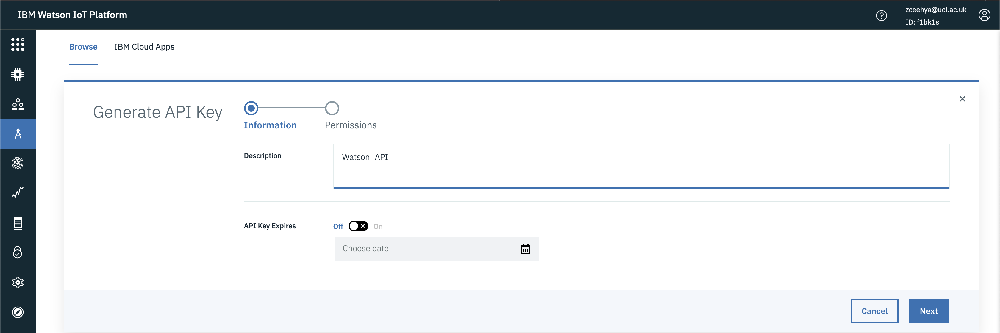

After filling in the __Description__, it can be proceeded:

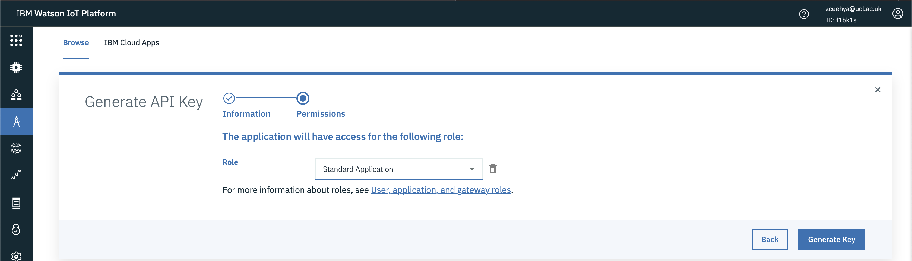

The role of the API key shall be selected as __Standard Application__.

Once clicking on the __Generate Key__ button, a page with the API key details will show up:

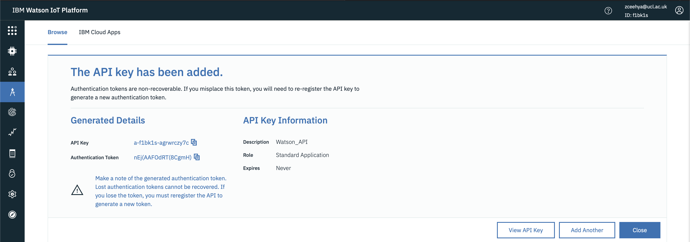

It is __important__ that this page (or the API Key details generated) is saved to be referred to later on since it will not be accessible again once leaving the page.

# Node-RED on Local Devices #

## Palette Required ##

In order to establish connection to the Watson IoT Platform, the __IBM Watson IoT__ is required:

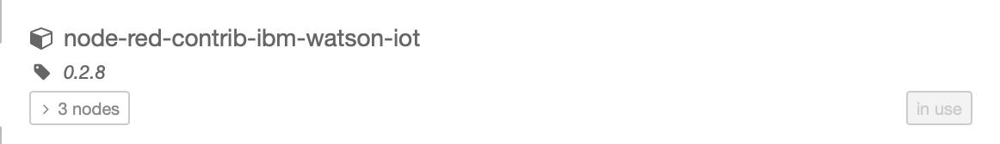

## Set up Watson IoT Node ##

Once any of the Watson IoT Node in the flow is opened, a pages as such is shown:

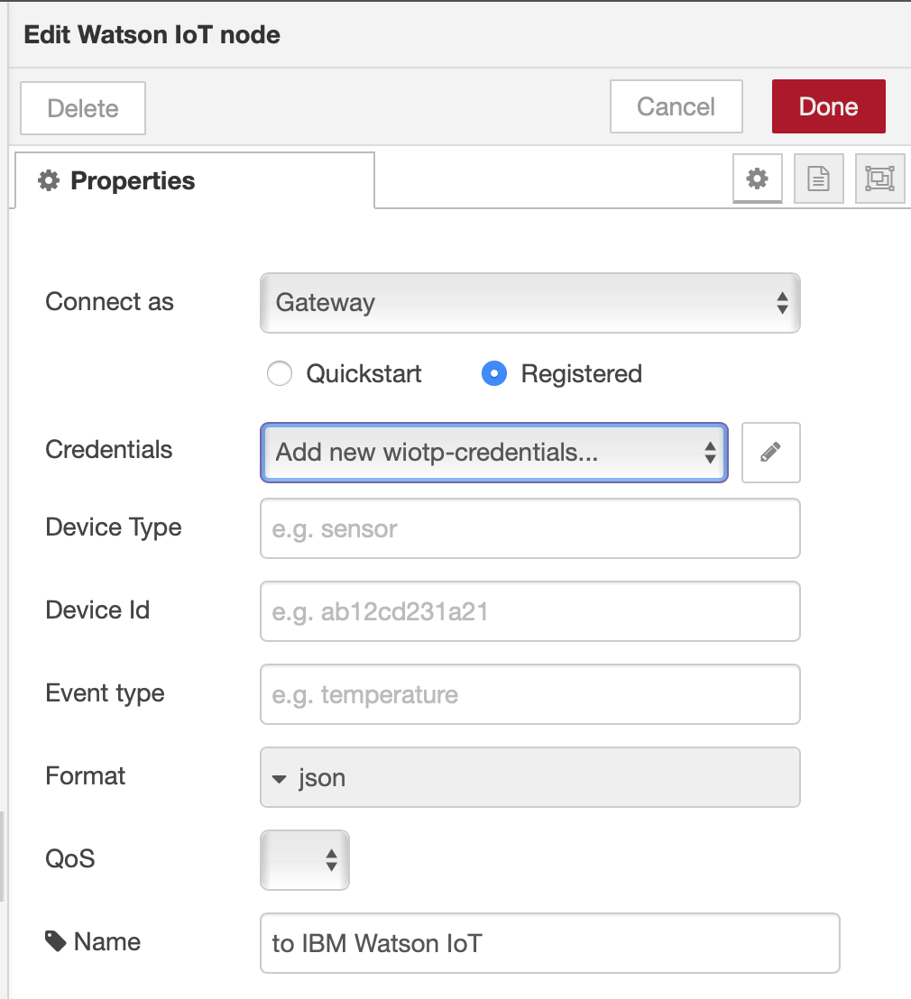

The node shall be selected to connect as __Gateway__ as shown.

Once clicking on the edit button on the __Credentials__ tab, a new page is brought up and the device credentials can be filled in:

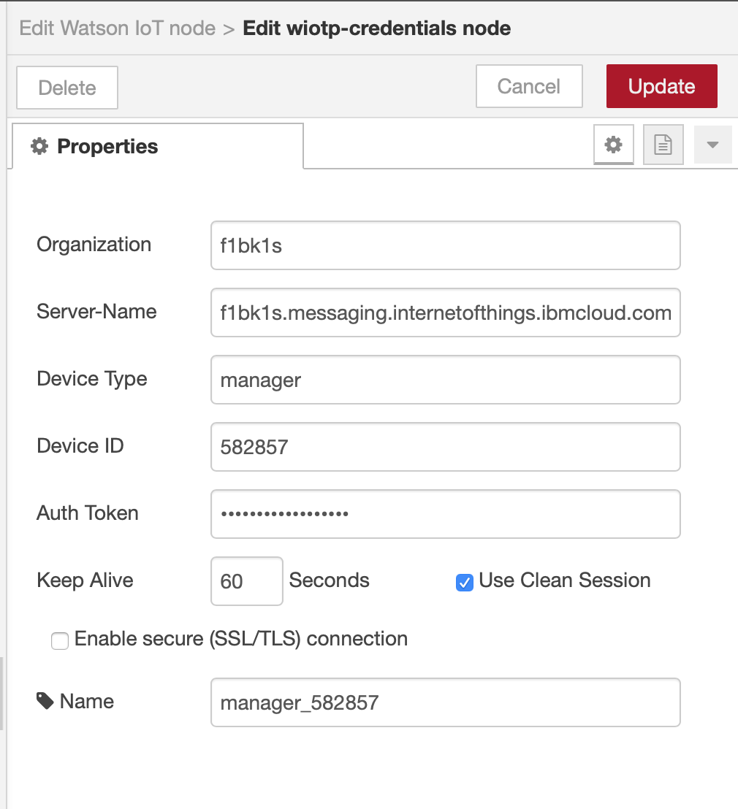

To fill in the properties, the [manager credentials obtained previously](#create-a-manager-device) shall be used:

Note that for the properties of the __wiotp-credentials node__, the corresponding information to be filled in is (characters in __[ ]__ represent information from the device credentials page):

* __Organization__: __[Organization ID]__ (*example*: f1bk1s)
* __Server-Name__: __[Organization ID].messaging.internetofthings.ibmcloud.com:8883__ (*Port is optional for added security*; *example*: f1bk1s.messaging.internetofthings.ibmcloud.com:8883)
* __Device Type__: __[Device Type]__ (same as the device type created previously, *example*: manager)
* __Device ID__: __[Device ID]__ (*example*: 582857)
* __Auth Token__: __[Authentication Token]__ (*example*: h(AZQiR7yR8S2dKc_5)

After clicking the __Update__ button to confirm the changes, and then the __Done__ button, the Watson IoT node should be in the __connected__ state after deploying the flow:

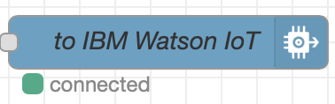

The manager device in the __Watson IoT Platform__ should be in the __connected__ state as well:

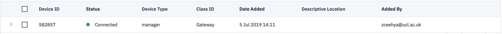

# Node-Red on Watson IoT Platform #

## Set up IBM IoT Node ##

Once any of the IBM IoT node in the flow is opened, a page as such is shown:
