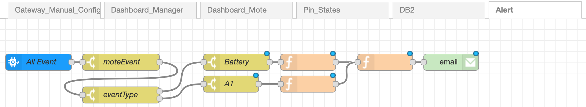

Table of Contents
=================
1. [Project Description](#project-description)
1. [System Structure](#system-structure)
    * [Manager, Mote and Sensors](#manager-mote-and-sensors)
    * [Raspberry Gateway](#raspberry-pi-gateway)
    * [Watson IoT Platform](#watson-iot-platform)
    * [IBM Cloud Node-RED Application](#ibm-cloud-node-red-application)
    * [Cloudant Database](#cloudant-database)
    * [DB2 on Cloud Database](#db2-on-cloud-database)
    * [User Devices](#user-devices)
1. [Software Features](#software-features)
    * [Flow Backup](#flow-backup)
    * [Automatic Deletion](#automatic-deletion)
    * [SQL Database](#sql-database)
    * [Fail-safe Mechanism](#fail-safe-mechanism)
1. [Hardware Features](#hardware-features)
    * [Deployment Design](#deployment-design)
    * [Unit Design](#unit-design)

# Project Description #

The aim of this project is to establish an end-to-end IoT system which can be deployed in a designated room, monitor the environment, collect and transmit data, store data, and allow the user to interact with the device and the data remotely.

The project strives to provide an intuitive and low-maintenance system which allows it to be implemented easily by a student with little or no prior knowledge.

By the end of the project, both the software and the hardware infrastructure is created. Detailed descriptions, explanation and tips are documented for each part of the system, allowing any new user of the system to become accustomed to the setup and maintenance processes.

# System Structure #

The overall structure of the implemented end-to-end system is shown in the digram below:


## Manager, Mote and Sensors ##

DC9003A-B SmartMesh IP motes are used in the project. Each mote is connected to various sensors through both digital and analog communication.

Based on the [SmartMesh IP Tools Guide](https://www.analog.com/media/en/technical-documentation/user-guides/smartmesh_ip_tools_guide.pdf) (page 191), there are 4 digital and 4 analog input pins on each mote.

On the sample mote, 2 digital and 2 analog pins are utilised. The humidity and light intensity sensors are analog since their output voltages varies with the environment. On the other hand, the PIR and vibration sensors are digital since their output voltages are either HIGH or LOW.

The DC2274 SmartMesh IP Manager is used in the project, which communicates wirelessly with the motes and receives their health reports, device events and responses.

The manager is connected to the gateway via USB connection, and communicates with the gateway through serial API.

## Raspberry Pi Gateway ##

The gateway to host the manager in this project is the Raspberry Pi due to its small size. Both Raspberry Pi 2 and 3 with Raspbian 8 or 9 are tested and verified to be working.

There are two applications running on the gateway. One of them is the JsonServer application that comes with the SmartMeshSDK applications. This application is responsible for the serial API communication between the gateway and the manager. The other application hosted on the gateway is the Node-RED flow. This is an intuitive design to send and receive HTTP requests and responses, and to send MQTT messages to the Watson IoT platform (when the gateway is connected to the internet).

## Watson IoT Platform ##

The Watson IoT Platform is used as a MQTT broker to receive MQTT messages sent and received by both the local and the cloud Node-RED flows.

Various alternatives, such as the Microsoft Azure, Google Cloud IoT Core, and other open source IoT platforms, are also tested. However, the Watson IoT Platform is chosen for the project due to the following advantages:

1. Low cost (free for small projects with an educational account)
1. Flexibility in the format of the JSON messages (other platforms may only support simple telemetry data instead of full JSON strings, largely limiting the applicability of the project)
1. Real-time MQTT messages (other platforms may only support http messages which impose difficulty in real-time communication between the user and the system)
1. Decent integration (the host of the platform, IBM Cloud, is able to host other applications such as the Node-RED flows and databases, allowing easier integration of the system, compared to other multi-platform solutions)

## IBM Cloud Node-RED Application ##

A Node-RED application is created and hosted on the IBM Cloud Service.

This Node-RED application contains flows that are responsible for both the data collection as well as the data output and user input on the graphic user interface.

This application is hosted on the IBM Cloud and can be running 24/7. It automatically receives and stores the data that is posted to the designated Watson IoT Platform by the manager.

MQTT messages sent from the gateway to the broker can be read by the application, and user inputs are converted in to HTTP requests as MQTT messages and sent back to the gateway via the Watson IoT Platform.

There is also a dashboard that comes with the Node-RED application, which acts as the user interface to monitor the managers and the motes remotely. The user is able to locate any manager and mote that is connected to the Watson IoT Platform, and to read and write data on the device.

## Cloudant Database ##

As the Node-RED application is created on the IBM Cloud Service, a corresponding Cloudant database is also created automatically.

The most important feature of the database is that it automatically stores the Node-RED flows in the application whenever a change is made to it. This feature makes the Cloudant database a backup solution of the online flows, and allows the user to retrieve the flows as a JSON array when the application does not run properly.

The database also allows data collected from the motes to be stored. However, it is not used in the project due to its NoSQL nature.

## DB2 on Cloud Database ##

The DB2 on Cloud database is used to store the device data in this project.

This database is chosen since it is a low cost SQL database and hosted on the IBM Cloud Service. Note that the free lite database has 200 MB of storage space and has to be re-activated every 30 days.

## User Devices ##

The user is able to access the online Node-RED flows, the graphic user interface and both databases on any device via the internet.

This largely enhances the accessibility and convenience of the designed system, making it a desired IoT solution to collect and manage data in the building.

# Software Features #

## Flow Backup ##

Both of the Node-RED flows on the gateway device and the cloud application are backed-up in different ways in order to prevent loss of flows in case of accidents.

On the gateway devices, the flows are backed-up as individual files whenever a change is made to them. The detailed explanation on how this can be done is documented in the [**Gateway**](../Gateway/README.md) section. Each time the flows are manually deployed, a new file with the current timestamp in its name will be created and saved on the local device. In the event when the flows are lost in the Node-RED, the user can retrieve the backed-up flows manually by navigating to the designated directories on the device.

The flows on the Node-RED application that is hosted on IBM Cloud are automatically backed-up in the Cloudant database which comes with the application. The detailed explanation on how to direct to the flow file and retrieve the flows is documented in the [**Watson-IoT-Platform**](../Watson-IoT-Platform/README.md) section.

## Automatic Deletion ##

An issue found in the Watson IoT Platform is that it does allow a mote to be connected to different managers. A mote type device is created on the platform whenever it is switched on and connects to the manager it detects. The device name created on the platform is the MAC address of the mote, and the device remains when the mote is switched off and disconnected from the manager. However, when the mote is used again in a different environment and connects to a new manager, the new manager will fail to create the mote type device on the platform with the same mote name. Although the mote is successfully connected to the manager, its events and responses will fail to be sent to the platform as MQTT messages.

A solution to this problem is that whenever a mote is disconnected from a manager, its corresponding mote type device on the platform is deleted, so that a new version of itself will be created by the new manager once a new connection is established. Thanks to the available palette online, a Device Manager node is used in the local Node-RED flows to detect a mote loss event and delete the corresponding mote device online. It should be noted that the gateway device which hosts the mote deletion flow shall **NOT** be powered off at least **1 minute** (sometimes it takes a longer time) after the mote is powered off. This is to allow the mote loss event to be detected by the manager. The user can also access the Watson IoT Platform to ensure that the mote device is indeed deleted.

Detailed tutorial on how the mote manager nodes are configured can be found in the [Gateway](../Gateway/README.md) section.

## SQL Database ##

One of the main objectives of the project is to provide a physical infrastructure for data collection which can later be used in other areas of study such as data analysis, localisation and so on.

To record the raw data collected from the deployed motes in an intuitive fashion, online SQL database is chosen. In this way, not only can the database be accessed anywhere, anytime and by anyone with access to it, it is also in the format on which data analysis (such as SQL queries) can run easily.

Fortunately, the DB2 on Cloud database is well integrated in the IBM cloud platform and can be written from the Node-RED application.

The sample table on the database is designed to record all input readings from the motes. The table can be easily created both on the DB2 on Cloud online console, or from the online Node-RED flow. Therefore, the user has total freedom to create and edit the tables to suit the purpose of each project. The sample table definition is as such:

|COLUMN NAME|DATA TYPE|
|:---------:|:-------:|
|Timestamp|VARCHAR|
|DeviceID|VARCHAR|
|Temperature|DOUBLE|
|Digital_D0|DOUBLE|
|Digital_D1|DOUBLE|
|Digital_D2|DOUBLE|
|Digital_D3|DOUBLE|
|Analog_A0|DOUBLE|
|Analog_A1|DOUBLE|
|Analog_A2|DOUBLE|
|Analog_A3|DOUBLE|

It can be seen from the table that the timestamp of the data collected and device ID that is used to distinguish the data source are recorded in the format of characters, while the data sample themselves are recorded as double precision float data. This table is created such that data collected from all motes connected to the same manager will be stored in one place, characterised by their different device ID names. In the event where the user wish to store data from each mote in its respective table, multiple tables with different names can be created, and selective columns of input pins can be added. The user may also wish to store data in the modified formats (for instance, converting raw analog voltage readings to relative humidity in %). This can be easily achieved through creating new flows in the online Node-RED application (through filtering out device messages by the device IDs and then pass to different tables).

Detailed tutorial on how the table can be created, and its data populated from the Node-RED flow, can be found in the [Watson IoT Platform](../Watson-IoT-Platform/README.md) section.

## Fail-safe Mechanism ##

Together with the hardware design, fail-safe features can be added to the system to improve its robustness. Due to the time constraint of the project, not all fail-safe mechanisms have been designed and tested.

One of the mechanism tested is the battery level indicator. The battery level of the SmartMeshIP motes can be remotely accessed through the built-in commands and the manager. However, the sensors are designed to be powered by an external power supply at 4.5 V, which cannot be accessed remotely.

In the event of battery level falling under roughly 3.5 V, the voltage level supplied to the sensors would fall below 3.3 V controlled by the linear voltage regulator. As such, the data recorded by the analog sensors would no longer be accurate. Therefore, a fail-safe design shall be designed to prevent the event from happening.

A simple design has been created as the solution. A voltage divider with a ratio of 1/3 is used, with resistor at very high values. This voltage divider is then connected parallel with the power supply batteries. The output of the smaller load is connected to one of the analog input pins on the mote. When the battery is fully charged, the smaller load would have approximately 1.5 V across it (with one end connected to the ground). The 1.5 V signal is passed to the mote and can be read on the online Node-RED dashboard. The user can then constantly monitor the battery level. The resistor values are kept very high so that it drains negligible current from the power supply. An additional transistor switch may be added for the fail-safe mechanism circuit in order to further improve its power efficiency.

A Node-RED flow is also resigned to send specific warning emails to the user when the battery level falls below a certain point. As such, it saves the trouble of the user to constantly monitor the changes, making the system more autonomous.

For example, one such flow is created:



The JSON string used for this flow is shown below:

```
[{"id":"4fb2f49b.1ad09c","type":"tab","label":"Alert","disabled":false,"info":""},{"id":"6c13105f.88d9f","type":"ibmiot in","z":"4fb2f49b.1ad09c","authentication":"apiKey","apiKey":"ca721d51.0376c","inputType":"evt","logicalInterface":"","ruleId":"","deviceId":"00-17-0d-00-00-58-e9-d8","applicationId":"","deviceType":"mote","eventType":"oap.temperature","commandType":"","format":"json","name":"All Event","service":"registered","allDevices":true,"allApplications":"","allDeviceTypes":true,"allLogicalInterfaces":"","allEvents":true,"allCommands":"","allFormats":"","qos":0,"x":80,"y":80,"wires":[["87423a3d.85aed8"]]},{"id":"87423a3d.85aed8","type":"switch","z":"4fb2f49b.1ad09c","name":"moteEvent","property":"deviceType","propertyType":"msg","rules":[{"t":"eq","v":"mote","vt":"str"}],"checkall":"true","repair":false,"outputs":1,"x":230,"y":80,"wires":[["4ab0b8e5.316748"]]},{"id":"4ab0b8e5.316748","type":"switch","z":"4fb2f49b.1ad09c","name":"eventType","property":"eventType","propertyType":"msg","rules":[{"t":"eq","v":"oap.analog.A0","vt":"str"},{"t":"eq","v":"oap.analog.A1","vt":"str"}],"checkall":"true","repair":false,"outputs":2,"x":230,"y":140,"wires":[["d3563b5b.d54918"],["23be0b49.0be8cc"]]},{"id":"d3563b5b.d54918","type":"switch","z":"4fb2f49b.1ad09c","name":"Battery","property":"payload.d.samples","propertyType":"msg","rules":[{"t":"lt","v":"1500","vt":"str"}],"checkall":"true","repair":false,"outputs":1,"x":440,"y":80,"wires":[["a76e2dff.a71cb8"]]},{"id":"23be0b49.0be8cc","type":"switch","z":"4fb2f49b.1ad09c","name":"A1","property":"payload.d.samples","propertyType":"msg","rules":[{"t":"eq","v":"0","vt":"str"}],"checkall":"true","repair":false,"outputs":1,"x":430,"y":120,"wires":[["3e99730.b29bb8e"]]},{"id":"a76e2dff.a71cb8","type":"function","z":"4fb2f49b.1ad09c","name":"","func":"msg.topic = 'Battery Warning'\nmsg.payload = {\n    'Current Level' : msg.payload.d.samples\n}\nreturn msg;","outputs":1,"noerr":0,"x":570,"y":80,"wires":[["2c334366.164d1c"]]},{"id":"3e99730.b29bb8e","type":"function","z":"4fb2f49b.1ad09c","name":"","func":"msg.topic = 'Analog Input 1 Warning'\nmsg.payload = {\n    'Sensor Reading' : 0\n}\nreturn msg;","outputs":1,"noerr":0,"x":570,"y":120,"wires":[["2c334366.164d1c"]]},{"id":"2c334366.164d1c","type":"function","z":"4fb2f49b.1ad09c","name":"","func":"return msg;","outputs":1,"noerr":0,"x":710,"y":80,"wires":[["747e184b.f11c38"]]},{"id":"747e184b.f11c38","type":"e-mail","z":"4fb2f49b.1ad09c","server":"smtp.gmail.com","port":"465","secure":true,"tls":true,"name":"","dname":"","x":830,"y":80,"wires":[]},{"id":"ca721d51.0376c","type":"ibmiot","z":"","name":"Watson_API","keepalive":"60","serverName":"f1bk1s.messaging.internetofthings.ibmcloud.com:8883","cleansession":true,"appId":"","shared":false}]
```

It should be noted that the addition of fail-safe features is achieved by sacrificing some analog and digital pins. Therefore, the number of sensors that can be deployed on a single mote is reduced.

Although fail-safe mechanisms are able to issue warnings before the malfunction of the system, they do come with trade-offs. As as result, future projects may explore how more efficient fail-safe mechanisms can be designed and deployed.

# Hardware Features #

## Deployment Design ##

## Unit Design ##
