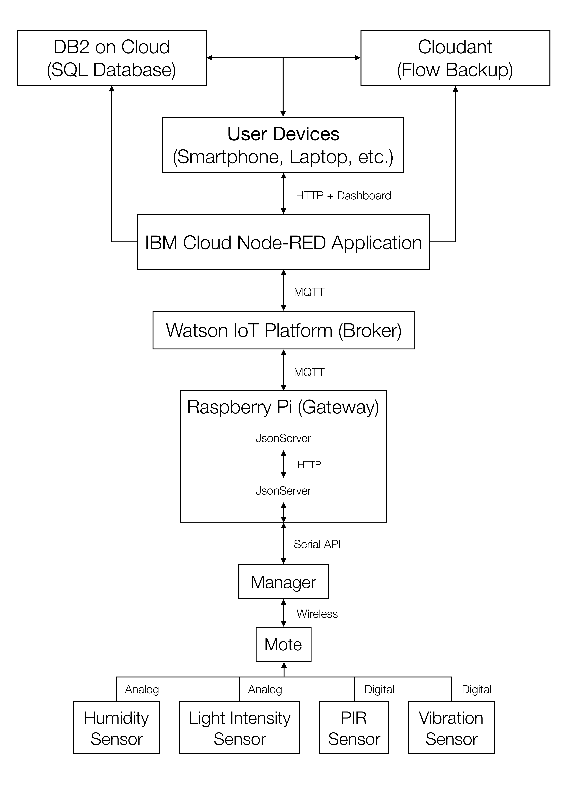

Table of Contents
=================
1. [Project Description](#project-description)
1. [System Structure](#system-structure)
    * [Manager, Mote and Sensors](#manager-mote-and-sensors)
    * [Raspberry Gateway](#raspberry-pi-gateway)
    * [Watson IoT Platform](#watson-iot-platform)
    * [IBM Cloud Node-RED Application](#ibm-cloud-node-red-application)
    * [Cloudant Database](#cloudant-database)
    * [DB2 on Cloud Database](#db2-on-cloud-database)
    * [User Devices](#user-devices)
1. [Software Features](#software-features)
    * [Flow Backup](#flow-backup)
    * [Automatic Deletion](#automatic-deletion)
    * [SQL Database](#sql-database)
    * [Fail-safe Mechanism](#fail-safe-mechanism)
1. [Hardware Features](#hardware-features)
    * [Deployment Design](#deployment-design)
    * [Unit Design](#unit-design)

# Project Description #

The aim of this project is to establish an end-to-end IoT system which can be deployed in a designated room, monitor the environment, collect and transmit data, store data, and allow the user to interact with the device and the data remotely.

The project strives to provide an intuitive and low-maintenance system which allows it to be implemented easily by a student with little or no prior knowledge.

By the end of the project, both the software and the hardware infrastructure is created. Detailed descriptions, explanation and tips are documented for each part of the system, allowing any new user of the system to become accustomed to the setup and maintenance processes.

# System Structure #

The overall structure of the implemented end-to-end system is shown in the digram below:

## Manager, Mote and Sensors ##

DC9003A-B SmartMesh IP motes are used in the project. Each mote is connected to various sensors through both digital and analog communication.

Based on the [SmartMesh IP Tools Guide](https://www.analog.com/media/en/technical-documentation/user-guides/smartmesh_ip_tools_guide.pdf) (page 191), there are 4 digital and 4 analog input pins on each mote.

On the sample mote, 2 digital and 2 analog pins are utilised. The humidity and light intensity sensors are analog since their output voltages varies with the environment. On the other hand, the PIR and vibration sensors are digital since their output voltages are either HIGH or LOW.

The DC2274 SmartMesh IP Manager is used in the project, which communicates wirelessly with the motes and receives their health reports, device events and responses.

The manager is connected to the gateway via USB connection, and communicates with the gateway through serial API.

## Raspberry Pi Gateway ##

The gateway to host the manager in this project is the Raspberry Pi due to its small size. Both Raspberry Pi 2 and 3 with Raspbian 8 or 9 are tested and verified to be working.

There are two applications running on the gateway. One of them is the JsonServer application that comes with the SmartMeshSDK applications. This application is responsible for the serial API communication between the gateway and the manager. The other application hosted on the gateway is the Node-RED flow. This is an intuitive design to send and receive HTTP requests and responses, and to send MQTT messages to the Watson IoT platform (when the gateway is connected to the internet).

## Watson IoT Platform ##

The Watson IoT Platform is used as a MQTT broker to receive MQTT messages sent and received by both the local and the cloud Node-RED flows.

Various alternatives, such as the Microsoft Azure, Google Cloud IoT Core, and other open source IoT platforms, are also tested. However, the Watson IoT Platform is chosen for the project due to the following advantages:

1. Low cost (free for small projects with an educational account)
1. Flexibility in the format of the JSON messages (other platforms may only support simple telemetry data instead of full JSON strings, largely limiting the applicability of the project)
1. Real-time MQTT messages (other platforms may only support http messages which impose difficulty in real-time communication between the user and the system)
1. Decent integration (the host of the platform, IBM Cloud, is able to host other applications such as the Node-RED flows and databases, allowing easier integration of the system, compared to other multi-platform solutions)

## IBM Cloud Node-RED Application ##

A Node-RED application is created and hosted on the IBM Cloud Service.

This Node-RED application contains flows that are responsible for both the data collection as well as the data output and user input on the graphic user interface.

This application is hosted on the IBM Cloud and can be running 24/7. It automatically receives and stores the data that is posted to the designated Watson IoT Platform by the manager.

MQTT messages sent from the gateway to the broker can be read by the application, and user inputs are converted in to HTTP requests as MQTT messages and sent back to the gateway via the Watson IoT Platform.

There is also a dashboard that comes with the Node-RED application, which acts as the user interface to monitor the managers and the motes remotely. The user is able to locate any manager and mote that is connected to the Watson IoT Platform, and to read and write data on the device.

## Cloudant Database ##

As the Node-RED application is created on the IBM Cloud Service, a corresponding Cloudant database is also created automatically.

The most important feature of the database is that it automatically stores the Node-RED flows in the application whenever a change is made to it. This feature makes the Cloudant database a backup solution of the online flows, and allows the user to retrieve the flows as a JSON array when the application does not run properly.

The database also allows data collected from the motes to be stored. However, it is not used in the project due to its NoSQL nature.

## DB2 on Cloud Database ##

The DB2 on Cloud database is used to store the device data in this project.

This database is chosen since it is a low cost SQL database and hosted on the IBM Cloud Service. Note that the free lite database has 200 MB of storage space and has to be re-activated every 30 days.

## User Devices ##

The user is able to access the online Node-RED flows, the graphic user interface and both databases on any device via the internet.

This largely enhances the accessibility and convenience of the designed system, making it a desired IoT solution to collect and manage data in the building.

## Fail-safe Mechanism ##
