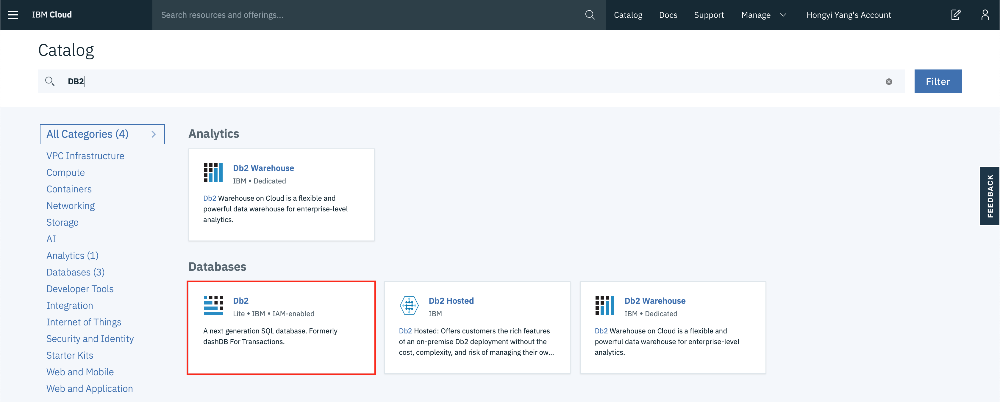
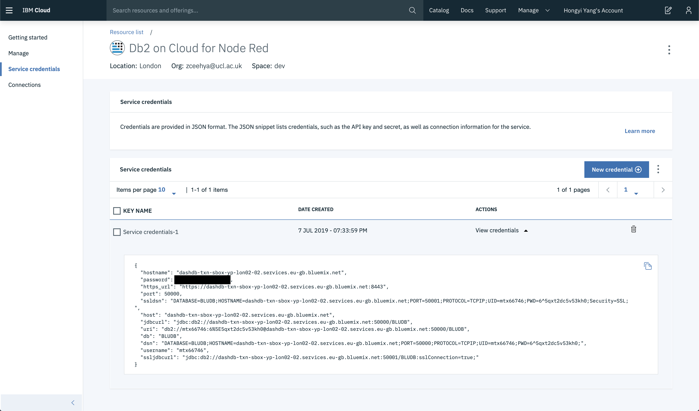
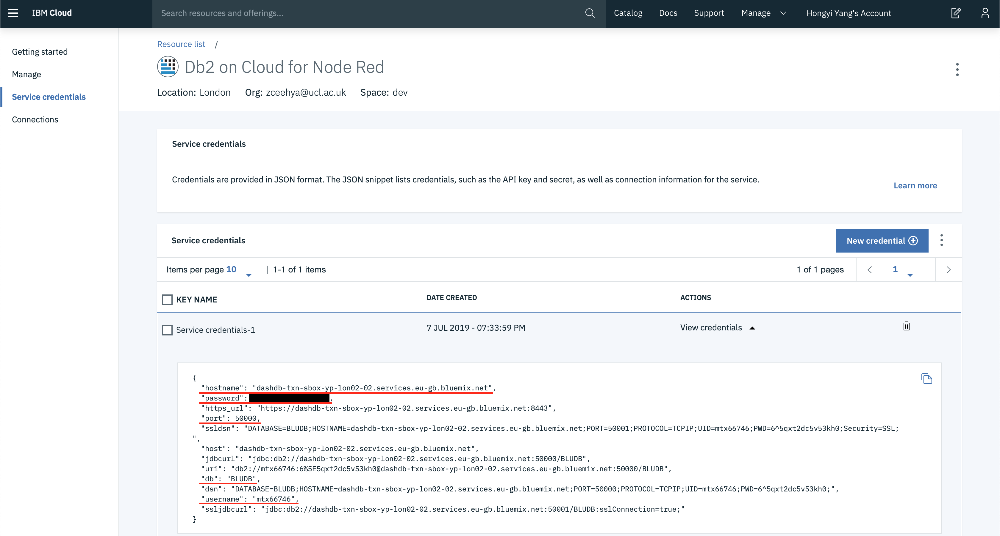

Table of Contents
=================
1. [Introduction](#introduction)
1. [ibmiot Node Configuration](#ibmiot-node-configuration)
1. [Gateway Manual Configuration](#gateway-manual-configuration)
1. [Manager Dashboard](#manager-dashboard)
1. [Mote Dashboard](#mote-dashboard)
1. [Pin States](#pin-states)
1. [DB2 on Cloud](#db2-on-cloud)
    * [Setting up DB2 on Cloud](#setting-up-db2-on-cloud)
    * [Using the DB2 on Cloud Database](#using-the-db2-on-cloud-database)
    * [Store Data to DB2 Database through Node-RED Flows](#store-data-to-db2-database-through-node-red-flows)

# Introduction #

Node-RED flows are hosted on the Watson IoT Platform in order to receive messages from the motes and managers, and to enable the user to manipulate and visualise the configurations of the motes and managers anywhere, at anytime.

The detailed setup guide of the Watson IoT Platform Node-RED application can be found in the [Basic-Setup-Guide](../Basic-Setup-Guide/README.md). Once the application is set up, flows ([cloud.json](cloud.json)) can be imported into it.

The file contains 5 individual flows, which are listed below with a short summary of their individual functionality:

1. [__Gateway_Manual_Configuration__](#gateway-manual-configuration): to configure and receive information from a specific manager
1. [__Dashboard_Manager__](#manager-dashboard): to display a dashboard containing information about a specific manager
1. [__Dashboard_Mote__](#mote-dashboard): to display a dashboard containing information about a specific mote connected to a specific manager
1. [__Pin_States__](#pin-states): to obtain information about the states of each pin on a specific mote
1. [__DB2__](#db2-on-cloud): to store data to the SQL database, DB2 on Cloud

# ibmiot Node Configuration #

The ibmiot nodes are used for the cloud Node-RED flows, which enable the flows to communicate with the Watson IoT Platform:


Click on any of the node and bring up the following:


The __Authentication__ method is chosen as __API Key__, and a new API Key can be added:


The __Name__ can be customised, and the next three configurations are done as such:

1. ```API Key : a-f1bk1s-agrwrczy7c```, this is the API Key of the Watson IoT Platform application, which has been created following the [setup guide](../Basic-Setup-Guide/README.md)

1. ```API Token : nEj(AAFOdRT(8CgmH)```, this is the API Token of the Watson IoT Platform application

1. ```Server-Name : f1bk1s.messaging.internetofthings.ibmcloud.com:8883```, this is the server name to connect to. It follows the format as __[orgId].messaging.internetofthings.ibmcloud.com:8883__, where __[orgId]__ is the organisation ID of the Watson IoT Platform applicaiton

Once the API information is configured correctly, the nodes will show as connected when the flow is deployed:


# Gateway Manual Configuration #

This flow should look like the following:


The first part of the flow requires the user to set variables of the flow:


Flow variables can be set in the function named "configure here first", and this should be done before the flows are deployed:


There are three variables to be configured:

1. ```flow.set('manager','582857')```, the manager name is the one registered on the Watson IoT Platform (detailed guide under the __Create a Manager Device__ section in the [Basic-Setup-Guide](../Basic-Setup-Guide/README.md)), and the one used here is __582857__

1. ```flow.set('mote',   '00-17-0d-00-00-58-e9-cd')```, the mote name is the full mac address of the mote interested, and the one used here is __00-17-0d-00-00-58-e9-cd__

1. ```flow.set('orgId',  'f1bk1s');```, the organisation ID refers to the one of the Watson IoT Platform application, which can also be found isn the [Basic-Setup-Guide](../Basic-Setup-Guide/README.md), and the one used here is __f1bk1s__

After setting up the variables, the flow can be deployed. When the inject node is pressed, a message should appear to show that the flow variables are configured:


The second part of the flow enables the user to receive the JsonServerResponse from the manager and messages from the mote:


The remaining part of the flow allows the user to inject enable/disable of each pin to the mote.

# Manager Dashboard #

This flow allows a manager to be manually configured first, and its information being displayed on the online dashboard:


The node-red-dashboard palette has to be installed first:


The manager is manually set up in the __configure here first__ function node:


There are two variables to be configured:

1. ```flow.set('serialPort','/dev/tty.usbserial-00002014D')```, this is the serialPort to which the manager is connected, and the port here is __/dev/tty.usbserial-00002014D__

1. ```flow.set('manager','582857')```, this is the name of the manager that the user wish to connect to, similar to the one configured in the previous flow, and it is __582857__ in this case

Once the flow is deployed, inject the manager configuration function to set the specific serialPort and manager. Note that this has to be done __before launching the dashboard UI__ in order for it to work properly.

The manager dashboard can then be viewed online, at the same url of the Node-RED application followed by an additional /ui. For example, the link to the application is this case is:

```
http://redshift.eu-gb.mybluemix.net
```

and the dashboard can be viewed at:

```
http://redshift.eu-gb.mybluemix.net/ui
```

When the dashboard is opened, a page similar to this will be shown (without the specific statistics):


Several functions can be achieved in this dashboard:

1. By clicking on the __```UPDATE NETWORK INFORMATION```__ button, the user will enable the flow to send request for network information of the manager selected, that is currently connected on the Watson IoT Platform. The returned statistics of the network will be displayed.

2. By clicking on the __```UPDATE MOTES```__ button, the user will enable the flow to send request for active motes that are connected to the manager set in the flow.

3. The __```Select Mote```__ dropdown list will show the returned active motes from the previous command, and the user can select a specific mote by clicking on it, and the dropdown list will be updated with the mote selected:


4. Once the mote is selected, by clicking on the __```UPDATE MOTE INFORMATION```__ button, the user will enable the flow to send request for information of the mote selected, and the returned statistics will be displayed.

# Mote Dashboard #

This flow allows a mote to be selected first, and the user is then able to view health reports from the mote, and to interact with all the inputs and outputs of the mote:


The first part the flow allows the user to manually set the manager that the flow is communicating to:


The configuration is the same as one done in the [__Dashboard_Manager__](#manager-dashboard) flow, and the name of the mote can be left as __undefined__.

The second part of the flow is in charge of updating the list of motes connected to the specific manager upon the user's request, and allows the user to select which mote to work on:


The third part of the flow listens to all events from the motes that are sent through the manager. It allows only the messages sent by the selected mote to pass through, and to be displayed on the dashboard:


The fourth part of the flow receives the user's input from the dashboard, creates commands and sends them to the mote through the manager:


When the dashboard is launched, the mote information page can be navigated on the sidebar:


Upon clicking on the __Mote__ option, a page as such will be shown:


The first column, __Mote Selection & Health Report__ allows the user to select the mote and view its health report.

Mote selection process here is identical to that in the manager page. Once the mote is selected, by pressing the __```SET SELECTED MANAGER AND MOTE```__ button, the user should see the manager and mote updated at __Current Manager__ as well as __Current Mote__. The health report will be automatically updated when the health report messages from the selected mote is sent to the manager.

After selecting both the mote and the manager, the user can then proceed to manipulate the inputs and outputs of the mote.

The second column of the dashboard contains the __temperature__ information. Note that the default states of all enable buttons on the dashboard are __"off"__. However, the gauges will show the readings if there are messages of the corresponding ports coming through. If the temperature is enabled, for example, the gauge will now start displaying the deceived temperature. The other information of the sample, including the sample rate, the sample size as well as the timestamp of the sample will also be shown. The user can set the sample rate at the __```Desired Sample Rate```__ section which ranges from 1000 ms to 300000 ms. Once the rate is selected, it can be set on the mote when the user presses the __```SET TEMPERATURE SAMPLE RATE```__ button.

The third column of the dashboard contains the __digital input__ information of all four digital input pins. The settings are similar to that of the temperature.

The fourth column of the dashboard allows the user to toggle the two digital output pins as well as the LED onboard (their default state is "off" even if any of the output is previously set to be "on").

The last column of the dashboard contains the __analog input__ information of all four analog input pins. Their configurations are similar to those of the digital input pins.

# Pin States #

This flow allows the user to obtain the states of a specific pin on the selected mote. The flow also updates the global variables that store the enable information on each pin on each mote, which is useful while transferring the received data to an online database:


The procedures to configure the variables used in this flow are the same as those in the other flows.

After configuring the variables and deploying the flow, the user can then manually obtain the information on each pin by pressing the corresponding injection button.

# DB2 on Cloud #

## Setting up DB2 on Cloud ##

First, navigate to the IBM cloud dashboard, and click on the __```Create resource```__ button:


Next, search for "DB2", and click on the one under "Databases" category:



In the new page, fill up the necessary information, choose the __Lite__ plan, and click the __```Create```__ button to create the service:


Now navigate back to the resource list of IBM cloud platform, and the DB2 database should appear under __Cloud Foundry Services__:


Click on the resource, and navigate to __Service credentials__ from the sidebar. Create a new service credential of the database by clicking on the __```New credential```__ button. The newly created service can then be viewed:



The database can be accessed by navigating to __Manage__ section from the sidebar, and click on the __```Open Console```__ button:


A page similar to the one below will then be shown:


## Using the DB2 on Cloud Database ##

Functions of the database can be accessed from the sidebar:


The __RUN SQL__ section allows the user to run SQL queries on the online database:


The __EXPLORE__ section allows the user to explore the databases that have been created:


Note that the new tables created will be stored in the default schema, which is __MTX66746__ in this case, at the time of this project, no additional schema can be created by the user through SQL queries.

## Store Data to DB2 Database through Node-RED Flows ##

The flow named __DB2__ is in charge of passing the received data to the designated database:


The first part of the flow allows the user to create a table in the database. The __dashDB__ node allows the user to configure the connection to the database, as well as the SQL queries:


The DashDB palette has to be installed first:


The query in the node is as such:

```
CREATE TABLE DATA (
	"Timestamp" varchar(20),
	"DeviceID"  varchar(50),
	"Temperature" float,
	"Digital_D0" float,
    	"Digital_D1" float,
	"Digital_D2" float,
	"Digital_D3" float,
	"Analog_A0" float,
	"Analog_A1" float,
	"Analog_A2" float,
	"Analog_A3" float
)
```

This allows a table named "DATA" to be created with columns storing timestamps, device IDs, and all readings. This query can also be run in the [__RUN SQL__](#using-the-db2-on-cloud-database) section.

The Server tab should be configured to match the service credential of the database:


The information required to complete this section can be found in the [__Service credentials__](#setting-up-db2-on-cloud) section of the DB2 on cloud service that has been created, the corresponding information has been highlighted below:



It can be seen in the function node in charge of formatting the data collected that there are two data transmission options are available:


The reason why data of all columns are sent as once is because this is the required format for the dashDB node to send queries to the database. Incomplete data may fail to be sent. Hence, the data is stored in flow variables as it is received at the beginning of the flow.

The first option is to transmit data based on whether the input pins are enabled. This is to prevent the flow variables to be sent when they are not updated (with their corresponding pins disabled):

```
    'Temperature' : (global.get(msg.deviceId+'.TempEnable')==1) ? flow.get(msg.deviceId + '.Temp')|0 : 0,
    'Digital_D0' : (global.get(msg.deviceId+'.D0Enable')==1) ? flow.get(msg.deviceId + '.D0')|0 : 0,
    'Digital_D1' : (global.get(msg.deviceId+'.D1Enable')==1) ? flow.get(msg.deviceId + '.D1')|0 : 0,
    'Digital_D2' : (global.get(msg.deviceId+'.D2Enable')==1) ? flow.get(msg.deviceId + '.D2')|0 : 0,
    'Digital_D3' : (global.get(msg.deviceId+'.D3Enable')==1) ? flow.get(msg.deviceId + '.D3')|0 : 0,
    'Analog_A0' : (global.get(msg.deviceId+'.A0Enable')==1) ? flow.get(msg.deviceId + '.A0')|0 : 0,
    'Analog_A1' : (global.get(msg.deviceId+'.A1Enable')==1) ? flow.get(msg.deviceId + '.A1')|0 : 0,
    'Analog_A2' : (global.get(msg.deviceId+'.A2Enable')==1) ? flow.get(msg.deviceId + '.A2')|0 : 0,
    'Analog_A3' : (global.get(msg.deviceId+'.A3Enable')==1) ? flow.get(msg.deviceId + '.A3')|0 : 0
```

The enable variables in this case can be updated in the previous flow, [__Pin States__](#pin-states), by injecting corresponding nodes.

The second option is to transmit data based on manual configuration:

```
    'Temperature' : flow.get(msg.deviceId + '.Temp')|0,
    'Digital_D0'  : flow.get(msg.deviceId + '.D0')  |0,
    'Digital_D1'  : flow.get(msg.deviceId + '.D1')  |0,
    'Digital_D2'  : flow.get(msg.deviceId + '.D2')  |0,
    'Digital_D3'  : flow.get(msg.deviceId + '.D3')  |0,
    'Analog_A0'   : flow.get(msg.deviceId + '.A0')  |0,
    'Analog_A1'   : flow.get(msg.deviceId + '.A1')  |0,
    'Analog_A2'   : flow.get(msg.deviceId + '.A2')  |0,
    'Analog_A3'   : flow.get(msg.deviceId + '.A3')  |0
```

The pins that are not required can be disabled by simply putting the value as 0. For example:

```
'Digital_D0'  : 0
```

It can be noticed that __"|0"__ is present after each flow variable. This is because when the data is received in the messages, it may be in the array form. Sending array variables to the DB2 database would result in the Node-RED application crashing. In fact, sending any data that is not in the same as the one defined in the table would cause the application to crash.

A delay node is also present in the flow before the queries are sent to the database. This is because the DB2 on Cloud database would allow only 5 concurrent global queries. Without the delay node, the queries may be sent at a rate so high that will be rejected by the database. It has been tested that sending 1 queries per second is completely safe.
